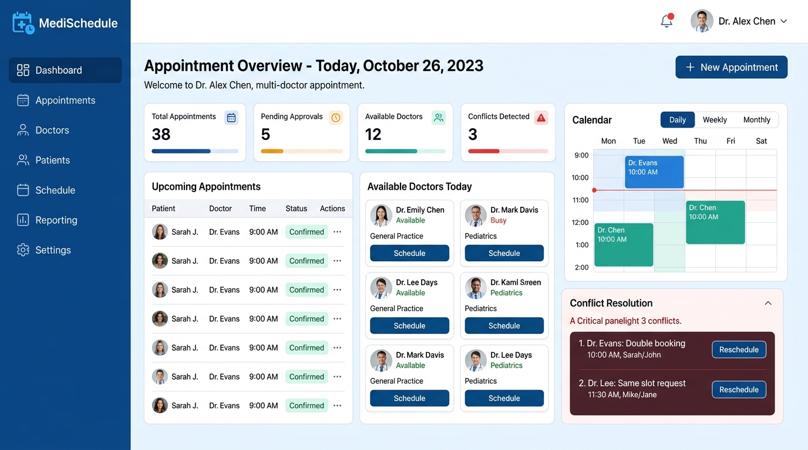
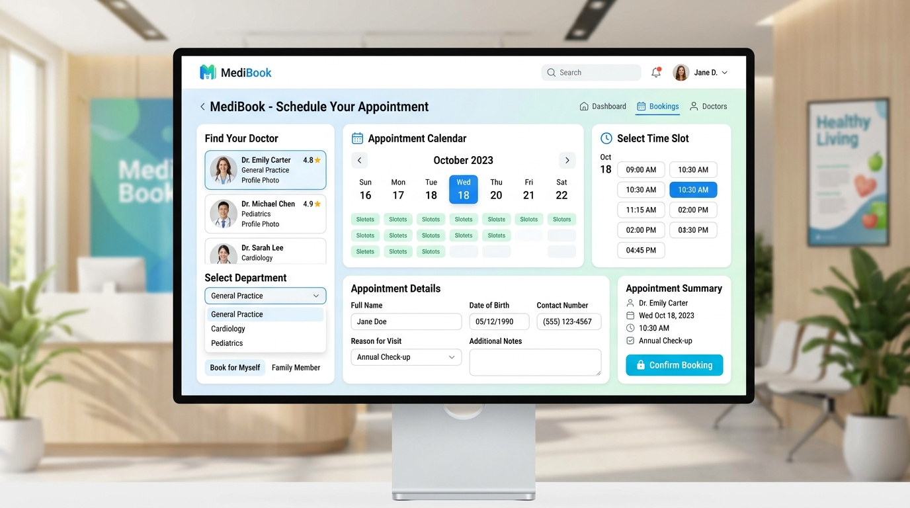

# 🏥 Doctor Appointment Scheduler

A comprehensive, multi-doctor appointment conflict scheduling system with a modern user interface and a robust Express/MongoDB backend. 

## ✨ Features

- **Multi-Doctor Scheduling:** Manage appointments for multiple doctors simultaneously.
- **Conflict Resolution:** Automatically detect and manage scheduling conflicts to ensure smooth operations.
- **Role-Based Dashboards:** Dedicated dashboards for Doctors and Administrators.
- **Patient Booking:** A clean and modern API-driven frontend for patients to book their visits easily.
- **Google Calendar Integration:** Seamlessly sync appointments.
- **Secure Auth:** JWT-based authentication to protect patient data.

---

## 📸 Screenshots

### 🩺 Doctor Dashboard
An overview of upcoming appointments, available doctors, and real-time conflict detection.


### 📅 Booking Interface
A vibrant, user-friendly interface for patients to select departments, doctors, and time slots.


---

## 🛠️ Technology Stack

- **Frontend:** HTML, CSS, JavaScript
- **Backend:** Node.js, Express.js
- **Database:** MongoDB (via Mongoose)
- **Authentication:** JSON Web Tokens (JWT) & bcryptjs
- **Integrations:** Google APIs (Calendar)

## 🚀 Getting Started

### Prerequisites
- Node.js installed on your machine
- MongoDB instance running

### Installation

1. **Clone the repository:**
   ```bash
   git clone https://github.com/PiyushDua03/Doctor-Appointment.git
   cd Doctor-Appointment
   ```

2. **Install dependencies:**
   ```bash
   cd server
   npm install
   ```

3. **Environment Setup:**
   Copy the example environment file and configure it:
   ```bash
   cp .env.example .env
   ```
   *(Make sure to update `.env` with your MongoDB URI, JWT Secret, and Google API credentials.)*

4. **Run the server:**
   ```bash
   npm start
   # or for development mode:
   npm run dev
   ```

5. **Open the frontend:**
   Simply open `landing.html` in your favorite browser to access the client interface!

## 📜 License

This project is licensed under the ISC License.
